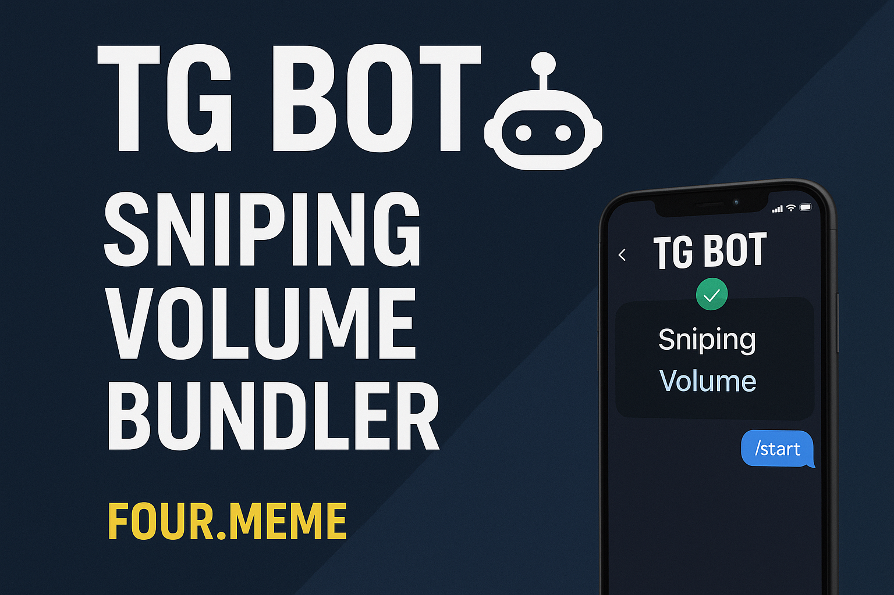
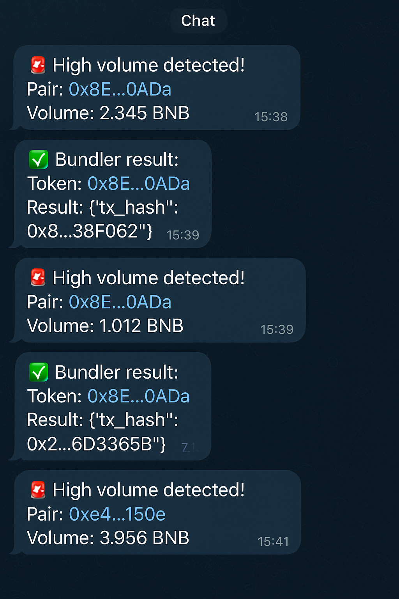

# BSC Four.meme Snipping, Vplume, Bundler — Rust (executor) + Node.js (orchestrator)

**Hybrid demo (production-style)**: a high-performance **Rust** executor for the execution hot-path, and a flexible **Node.js / TypeScript** orchestrator for event listening, heuristics and orchestration.

> ⚠️ **This repository is a demo intended for testnet / forked mainnet use only. Do NOT use with real funds on mainnet until you fully audit, harden, and secure your deployment.**

---

<p align="center">
  
</p>


## Purpose

This project demonstrates a pragmatic production-style architecture used for high-frequency DeFi operations:

### Workflow & Bot Functions
- 1. **PairCreated**: Node.js orchestrator subscribes to liquidity events.
- 2. **Pre-Buy Checks**: owner check, transfer simulation, ERC20 metadata, getAmountsOut validation.
- 3. **Volume Bot**: monitors BNB volume on pairs; triggers alerts or bundler buys when thresholds exceeded.
- 4. **Token Bundler**: batches multiple buy tasks and sends them concurrently to the Rust executor.
- 5. **Telegram Notifier**: alerts you on:
    High-volume pairs
    Bundler buy success/failure
    Pre-buy check results


<p align="center">
  
</p>

---


- **Node orchestrator (TypeScript)** — listens for `PairCreated` and liquidity events, performs heuristics/pre-checks, posts buy requests to executor. (Signal Handler, Bundler Execution Signal, Volume Execution Signal)
- **Rust executor (Actix + ethers-rs)** — minimal, deterministic hot-path that builds/signs/submits swap transactions (`swapExactETHForTokensSupportingFeeOnTransferTokens`).

The split keeps fast deterministic transaction logic in Rust and flexible orchestration logic in Node for quick iteration.

---

### API(Rust executor)
Post / buy
Content-Type: application/json


### Development notes & architecture rationale
- **Rust Executor**: deterministic, low-latency, compiled binary for the critical path. Ideal for signing & sending txs reliably.
- **Node orchestrator**: fast iteration, rich DeFi tooling, easier to write heuristics/token-safety scans, and integrations (alerts, UIs).
- Keep the hot-path as small as possible — business logic, heavy checks, ML scoring should live in orchestrator or a separate service.


## Environment Variables

**Copy `.env.example` -> `.env` and edit. Never commit secrets.**

### `node-orchestrator/.env`
```env
WS_RPC=wss://bsc-testnet.example/ws
HTTP_RPC=https://bsc-testnet.example
PRIVATE_KEY=0xYOUR_TESTNET_PRIVATE_KEY
FACTORY_ADDRESS=0xCA143Ce32Fe78f1f7019d7d551a6402fC5350c73
ROUTER_ADDRESS=0x6725F303b657a9451d8BA641348b6761A6CC7a17
WBNB_ADDRESS=0x...          # optional override
EXECUTOR_URL=http://127.0.0.1:8080

# Demo knobs
BUY_AMOUNT_BNB=0.02
SLIPPAGE=0.30
DEADLINE_SECS=60

# Volume Bot
VOLUME_WINDOW_SECS=60
VOLUME_ALERT_THRESHOLD_BNB=1.0

# Bundler
BUNDLER_CONCURRENCY=3

# Telegram Notifier
TELEGRAM_BOT_TOKEN=123456:ABCDEF
TELEGRAM_CHAT_ID=987654321


### CI / Docker / Deployment notes
- **Add GitHub Actions workflows**:
  Rust: cargo fmt -- --check, cargo clippy, cargo build --release
  Node: npm ci, npm run lint, npm run build
- Dockerize executor & orchestrator with environment variables injected at runtime (do NOT bake secrets).
- Use container orchestration (K8s) or systemd with secret mounts for production.

### Support / Contact
If you have any question or something, feel free to reach out me anytime via telegram, discord or twitter.
<br>
#### 🌹 You're always welcome 🌹

Telegram: [@Leo](https://t.me/shinnyleo0912) <br>
